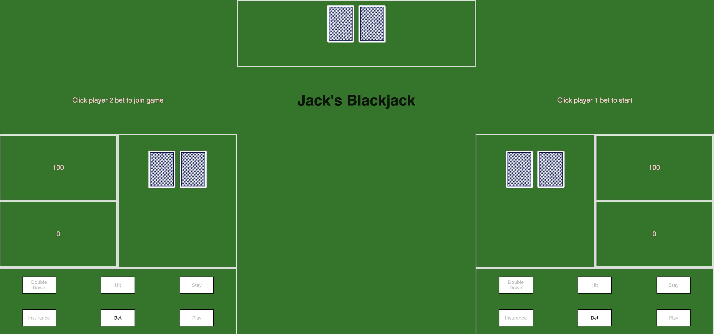
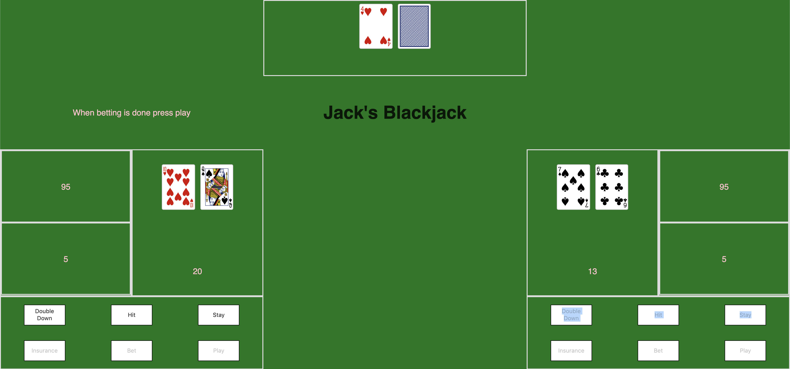

Welcome to Jack's Blackjack!

Screenshots:

Technologies used: JavaScript, HTML, CSS, Chrome, Git-Hub, Netlify, VSCode, Apple.

Getting Started:
For 1 player:
Click the bet button to place a bet and then play to start the game.
For 2 players:
Click player 2 bet before clicking play in order to add player 2 to the game.

Potential upcoming features:
Adding split functionality to the game.
Adding additional players.

https://flamboyant-torvalds-80fa0b.netlify.com/
